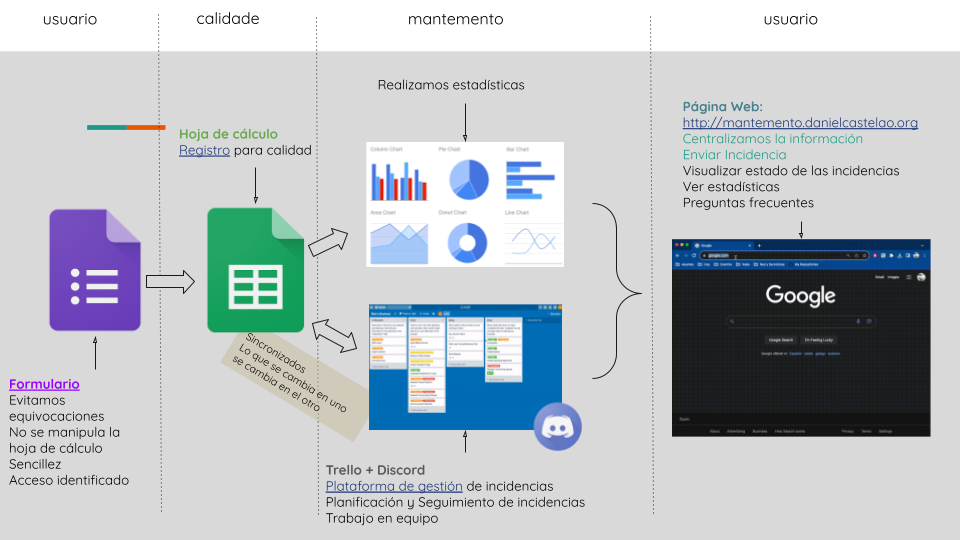

# Gestión de Incidencias

Scripts para la gestión de incidencias en el centro de Formación Profesional "Daniel Castelao".

---

## Descripción

El proyecto consta de distintas partes para la gestión de incidencias informáticas

Estas incidencias son cursadas por el profesorado del centro de Formación Profesional

La empresa de mantenimiento se encarga de solucionar las incidencias

El coordinador de mantenimiento es el encargado de organizar las incidencias y de las tareas de mantenimiento

El ojetivo del proyecto es:

- Facilitar la comunicación entre el profesorado y la empresa de mantenimiento
- Facilitar la organización de las tareas de mantenimiento
- Estadisticas de las incidencias
- Fluidez en la comunicación
- Automatización de la mayor cantidad de tareas posibles

---

## Tecnologías usadas

- [Google Apps Script](https://www.google.com/script/start/)
- [Trello](https://trello.com/)
- [Google Sheets](https://www.google.com/sheets/about/)
- [Google Forms](https://www.google.com/forms/about/)
- [Google Site](https://sites.google.com/)
- [Discord](https://discord.com/)

## Funcionalidad

### Creación de incidencias

Mediante un formulario de google se crean las incidencias, por lo tanto, se añaden a una hoja de cálculo

Esta hoja de cálculo es necesaria para el sistema de Calidad del Centro

Al añadir una incidencia ocurren varias cosas:

- Se crea una tarjeta en Trello
- Se añade un mensaje en Discord para notificar a la empresa de mantenimiento
- Se envía un correo a la persona que are la incidencia y al responsable de aula (cada aula tiene un profesor responsable)

### Organización de las incidencias y tareas de mantenimiento

- El coordinador de mantenimiento organiza las tareas de mantenimiento en Trello, aplicando etiquetas descriptivas y prioridades

### Resolución de incidencias

- Desde el panel de Trello se puede cambiar el estado de la incidencia, lo que envía un mensaje a Discord y un correo a la persona que creó la incidencia
- Se puede añadir un comentario en la tarjeta de Trello, para dejar constancia de la resolución de la incidencia
- Se utiliza Discord como herramienta de deate y consulta para lo que se quiere realizar con la incidencia
- Todo el envio de correo y cambio de estado se hace mediante Google Apps Script

### Información y Estadíscas

- Todo se centraliza en una página web a disposicion de los usuarios
- Se pueden ver estadísticas de las incidencias, como el tiempo medio de resolución, el número de incidencias por aula, el número de incidencias por tipo, etc.

## Cuadro descriptivo del sistema

